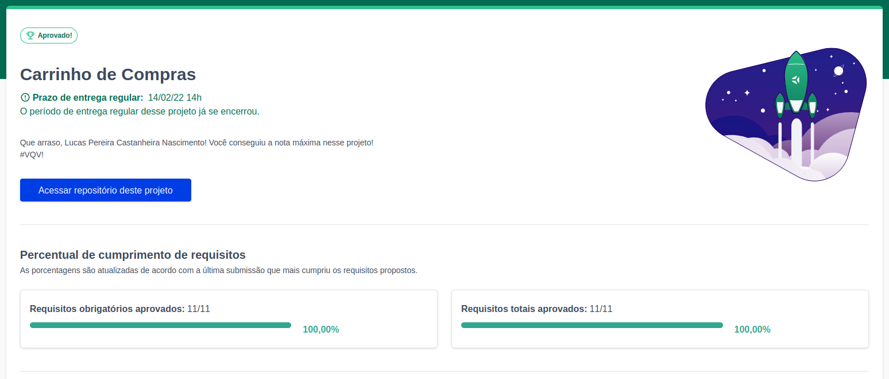
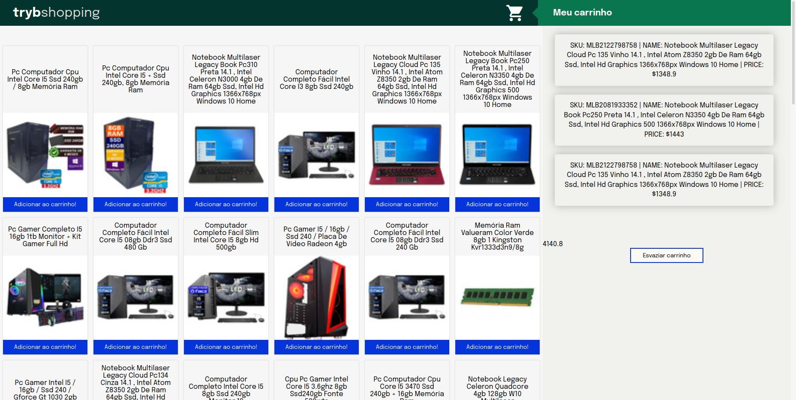

# shopping-cart

<h2>:brazil: Português :brazil:</h2>

Projeto entregue durante o curso de desenvolvimento Web ministrado pela <a href="https://www.betrybe.com" targe="_blank" rel="nofollow">Trybe</a>.

Obtive a aprovação no projeto completando 100% dos requisitos obrigatórios e opcionais. Efetivando, assim, a conclusão do Bloco 9 (JavaScript e Testes Assíncronos) referente ao Módulo 1 (Fundamentos do Desenvolvimento Web).

Descrição:
 

O projeto tinha como objetivo desenvolver um carrinho de compras totalmente dinâmico! E o melhor: consumindo dados diretamente de uma API! Isso mesmo. Da sigla em inglês Application Programming Interface, uma API é um ponto de contato na internet com determinado serviço. Através de requisições HTTP a essa API é possível interagir com ela da forma como quem a criou planejou. Aqui usaremos a API do Mercado Livre para buscarmos produtos à venda.

Habilidades desenvolvidas

<ol>
<li>Fazer requisições a uma API (Application Programming Interface) do Mercado Livre;</li>
<li>Utilizar os seus conhecimentos sobre JavaScript, CSS e HTML;</li>
<li>Trabalhar com funções assíncronas;</li>
<li>Implementar testes unitários.</li>
</ol>

Link para conferência: https://lucas-pcn.github.io/shopping-cart/

<a href="https://www.linkedin.com/in/lucas-pereira-castanheira-nascimento-238355190/" targe="_blank" rel="nofollow">Meu Linkedin</a>.

 

<h2>:us: English :us:</h2>

Project delivered during the Web development course taught by <a href="https://www.betrybe.com" targe="_blank" rel="nofollow">Trybe</a>.

I passed the project by completing 100% of mandatory and optional requirements. Thus, completing Block 9 (JavaScript and Asynchronous Tests) referring to Module 1 (Fundamentals of Web Development).

Description:

The project aimed to develop a fully dynamic shopping cart! And the best: consuming data directly from an API! That's right. From the acronym in English Application Programming Interface, an API is a point of contact on the internet with a certain service. Through HTTP requests to this API, it is possible to interact with it in the way that whoever created it planned. Here we will use the Mercado Livre API to search for products for sale.

Developed skills

<ol>
<li>Make requests to an API (Application Programming Interface) from Mercado Livre;</li>
<li>Use your knowledge of JavaScript, CSS and HTML;</li>
<li>Work with asynchronous functions;</li>
<li>Implement unit tests.</li>
</ol>

Conference link: https://lucas-pcn.github.io/shopping-cart/

<a href="https://www.linkedin.com/in/lucas-pereira-castanheira-nascimento-238355190/" targe="_blank" rel="nofollow">My Linkedin</a>.

